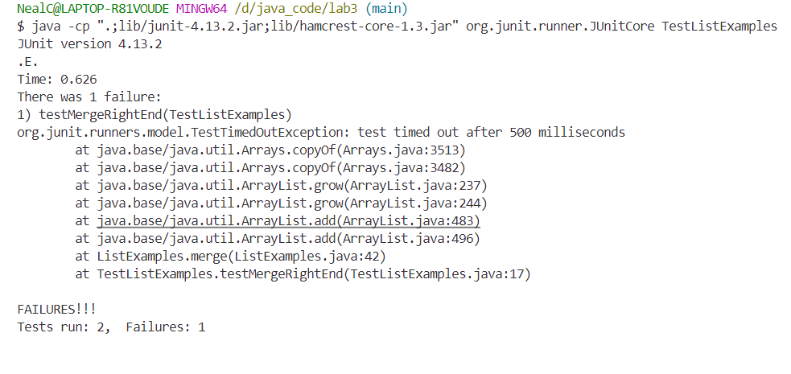
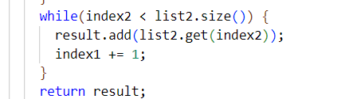
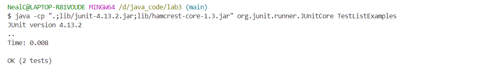
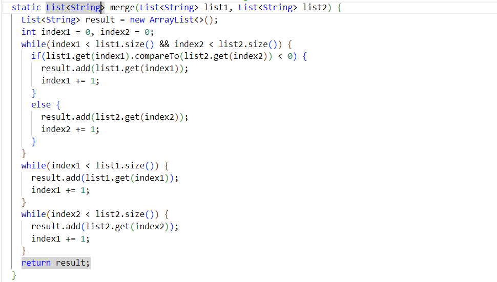

# Lab Report 5 - Putting it All Together (Week 9)

## Part 1 – Debugging Scenario

### Original Student Post

**Problem Description:**
The issue I'm encountering is the program runs too long to finish its task, according to the test output the program should be finished in 500 miliseconds, but it exceeded the limit time, it shows that the isssue occured at the merge function, which induced the program exceeding the expected time.


<!-- Describe the issue you're encountering. Include any relevant background or steps leading up to the problem. -->



<!-- Upload the screenshot showing the symptom or issue you're encountering. -->

**Guess at the Bug / Failure-Inducing Input:**

Line 42 is suspecious since we're looping through list2, but its iterating through list2 by using index1, which is the varaible to count through list1 as the varaible to count through list2, 
<!-- Provide your initial guess at what the bug might be or describe the input that leads to the failure. -->

### TA Response

**Question or Command Suggestion:**
TA: That was a good guess! I think you spotted the symtom and made a great choice, index1 is indeed the variable to count through list1, now think about under this context, what should you change to make the while loop loop through list2 properly?
<!-- Mimic a TA's response here, asking a leading question or suggesting a command to try in order to further diagnose the issue. -->

### Student Follow-Up

**New Information (Screenshot/Terminal Output):**

<!-- Upload a screenshot or paste the terminal output you got after following the TA's suggestion. -->

**Description of the Bug:**
The bug was induced by the result I got from analyzing the code and test output. I identified this problem by read through the test output, it shows me where I did wrong in my code, so I can spot which function is having issue. Then compare the test that induced the problem, by doing so, I was able to spot the bug and fixed it.
<!-- Now that you have more information, describe the bug in more detail. What's going wrong, and how did you identify it? -->

### Setup Information

**File & Directory Structure:**
The directory I'm currently in is `D:\java_code\lab3\`, and the files in this directories are 


```
ArrayExamples.class  ArrayTests.java    grade.sh      LinkedList.class        ListExamples.java    TestListExamples.class
ArrayExamples.java   FileExample.class  IsMoon.class  LinkedListExample.java  Node.class           TestListExamples.java
ArrayTests.class     FileExample.java   lib/          ListExamples.class      StringChecker.class
```
<!-- Provide a description or diagram of the file and directory structure needed for your scenario. -->

**Contents of Each File Before Fixing the Bug:**

- `merge` method designed to merge two sorted lists into a single sorted list. The method takes two `List<String>` objects as parameters and returns a new `List<String>` that is the result of merging the two input lists.
<!-- For each relevant file, briefly describe its contents or purpose before you fixed the bug. -->

**Command Line(s) to Trigger the Bug:**
```
javac ListExamples.java
javac -cp ".;lib/hamcrest-core-1.3.jar;lib/junit-4.13.2.jar" TestListExamples.java
java -cp ".;lib/junit-4.13.2.jar;lib/hamcrest-core-1.3.jar" org.junit.runner.JUnitCore TestListExamples.java
```
<!-- List the full command line or lines you ran that led to the bug's manifestation. -->

**Fixing the Bug:**
As I described previously, Variable Index1 needs to be changed. I changed it to index 2 so that it can loop through `list2`
<!-- Describe what needs to be edited or changed in order to fix the bug. Include specific lines of code or commands where applicable. -->

## Part 2 – Reflection
I've learned that having a in-detailed lab report can help with recap,to make sure you can make the things you've done one more time. Technical topics like git, vim(editing from the command).. are really helpful with future coding expereience, especially by improving effeciency of my workflow.
<!-- In a couple of sentences, describe something you learned from your lab experience in the second half of this quarter. This could be a technical topic, a discovery you made, or a valuable lesson from a tutor or classmate. -->
